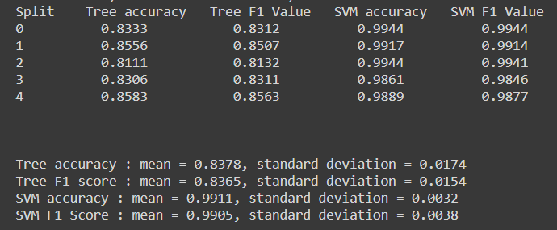

#ML-Ops: 
Assignment 7:
Comparision between Tree and SVM are drawn upon training 60% of data, chosen randomly 5 times.
Results:

SVM is a better model With higher mean Accuracy with lower deviation.

