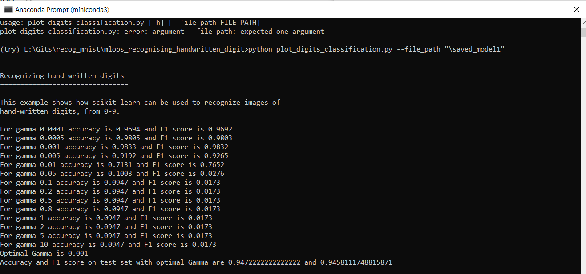

#ML-Ops: 
Assignment 4:
Recognising Handwritten Digits

Run the python code with command: python plot_digits_classification.py --file_path \<enter filepath to store model\>

The python file was run in local machine with mini-conda environment.
The data was split into three sets, train, validation, test.
The classifier was trained with different gammas. The model with the best validation score was stored to a filepath given as argument.
The optimal model was loaded from the same filepath and evaluated on test set.
The result is given bellow:

