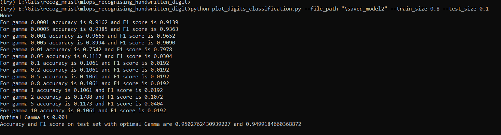

#ML-Ops: 
Assignment 5:
Recognising Handwritten Digits

Run the python code with command: python plot_digits_classification.py --file_path \<enter filepath to store model\> --train_size \<enter train size as a decimal value in range 0 to 1\> --test_size \<enter test size similarly \>

The python file was run in local machine with mini-conda environment.
1. The code was written so thet model is trained once even for oiptimal gamma
2. The code was written in modularized fashion with functions.
3. Minimum accuracy was set to 30% to throw away random models
4. Model was saved in hard disk in the file path given
5. File path, train split and test split was taken as arguments instead of hardcoded values
The result is given bellow:

