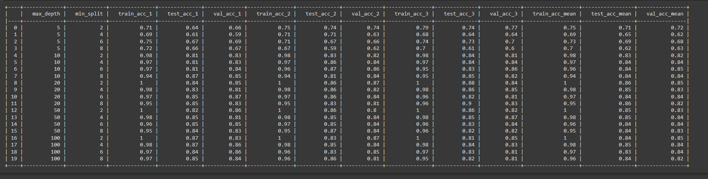

#ML-Ops: 
Final Exam
Recognising Handwritten Digits

Run the python code with command: python plot_digits_classification.py

Model chosen = decision tree
hyperparameters chosen = maximum depth and minimum number of samples needed to split.

The result is given below:

Observation:
1. There are variations for each run and this is because data is changing in each run.
2. we can see high values of maximum depth (eg. 100) and low values of minimum sample for split(eg 2) are leading to overfitting.
3. In those cases, avarage training accuracy is high but test and validation accuracy is low. 

