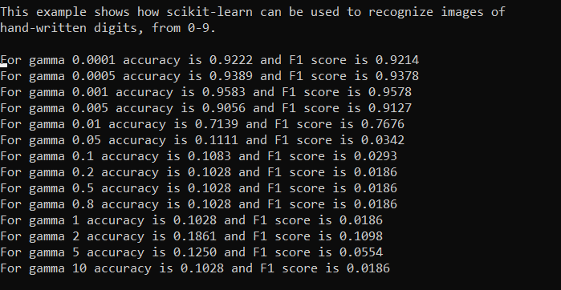
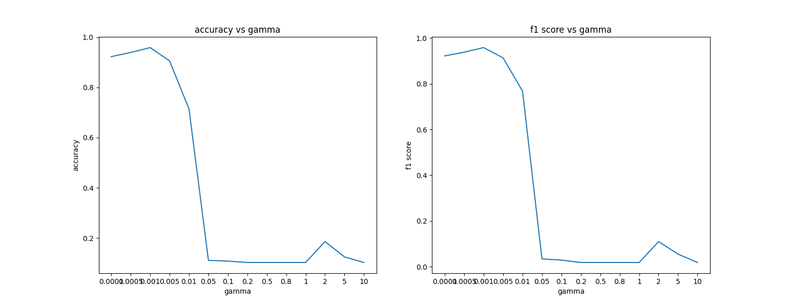

#ML-Ops: 
Lab assignment on 10th September:
Recognising Handwritten Digits

The digit recognition algorithm was ran for different gammas and the results are attached bellow:

OBSERVATION:

We see that the optimum gamma is 0.001. both lower gamma and higher gamma causes the accuracy to drop.

