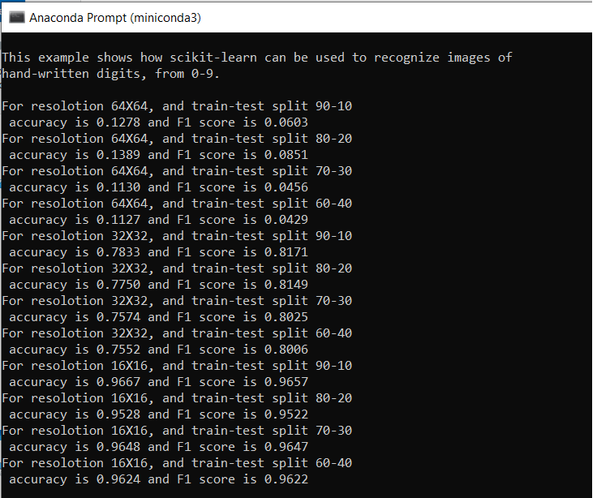

#ML-Ops: 
Lab quiz on 3nd September:
Recognising Handwritten Digits

The digit recognition was ran for different resolution and the results are attached bellow:

We see that the more resuloution is causing accuracy to drop and the more training samples are causing accuracy to raise.

