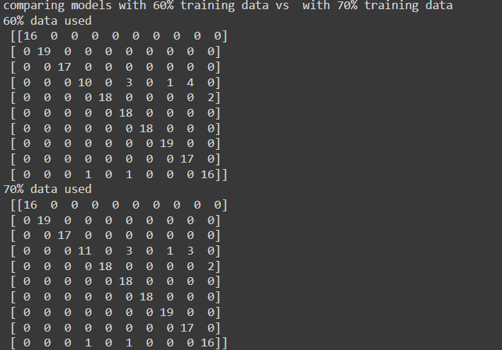

#ML-Ops: 
Assignment 11
Recognising Handwritten Digits

1. 80-10-10 training-dev-test data is created.
2. 10 to 100 % of training data is used to train the model (svm) and obtain optimum model with the help of validation data.
3. All models are tested with test data and the accuracies are plotted against percentage of training data used.
The result is given below:

We can see the accuracy is better when we use more training data. the accuracy is lowest with 10% training data. Hence, using more training data is better for model.

Now we compare individual models like 10%data vs 20%data with their confusion matrix on test data:

We can see, the number of correctly classified data for each class is increasing whereas the number of miscalssified samples are decreasing.

Similar trend is observed in the rest of the comparisons:

