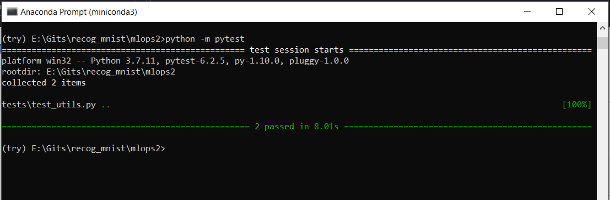

#ML-Ops: 
Assignment 6:
Recognising Handwritten Digits - Testing

Run the testing codes with command: python -m pytest

The python file was run in local machine with mini-conda environment.

Two testing functions were written in test folder:
1. to test if model is created or not
2. to test if model training metrices are above certain threshold or not

The result is given below:

